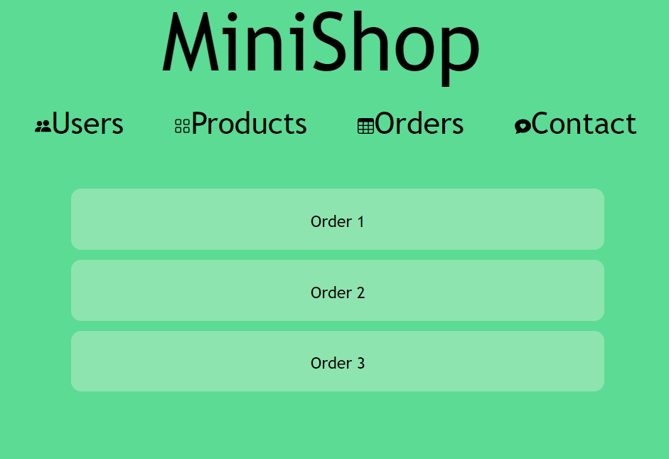

# MiniShop - LEANG Denis

</div>

<!-- TABLE OF CONTENTS -->
<details>
  <summary>Table of Contents</summary>
  <ol>
    <li>
      <a href="#about-the-project">About The Project</a>
      <ul>
        <li><a href="#built-with">Built With</a></li>
      </ul>
    </li>
    <li>
      <a href="#getting-started">Getting Started</a>
      <ul>
        <li><a href="#prerequisites">Prerequisites</a></li>
        <li><a href="#installation">Installation</a></li>
      </ul>
    </li>
    <li><a href="#usage">Usage</a></li>
    <li><a href="#contact">Contact</a></li>
  </ol>
</details>

<!-- ABOUT THE PROJECT -->
## About The Project

This is a simplistic shop only displaying lists of products, users and orders.

<p align="right">(<a href="#top">back to top</a>)</p>

### Built With

* [Node.js](https://nodejs.org/en/)
* [Angular](https://angular.io/))

<p align="right">(<a href="#top">back to top</a>)</p>

<!-- GETTING STARTED -->
## Getting Started

### Prerequisites

Clone the repository with SSH or HTTPS
   ```sh
   git clone git@github.com:YeriAddict/MiniShop.git
   ```
   ```sh
   git clone https://github.com/YeriAddict/MiniShop.git
   ```

### Installation

You will need to init and install Angular CLI.
 ```sh
  npm init 
  ```
 
 ```sh
  npm install -g @angular/cli 
  ```

<p align="right">(<a href="#top">back to top</a>)</p>

<!-- USAGE EXAMPLES -->
## Usage

1. Inside the root of the repository, type this command inside a terminal to start the app :
 ```sh
  ng serve --open
  ```

2. Go to your browser and enter this URL :
 ```sh
  (http://localhost:4200/)
  ```

3. You can now choose to check users, products or orders




4. You can also click on any element of the lists to find more details


5. Finally, you can submit a message which will be displayed in an alert box 


<p align="right">(<a href="#top">back to top</a>)</p>

<!-- CONTACT -->
## Contact

LEANG Denis - denis.leang@telecom-st-etienne.fr 

Link: [https://github.com/YeriAddict/MiniShop](https://github.com/YeriAddict/MiniShop)

<p align="right">(<a href="#top">back to top</a>)</p>
